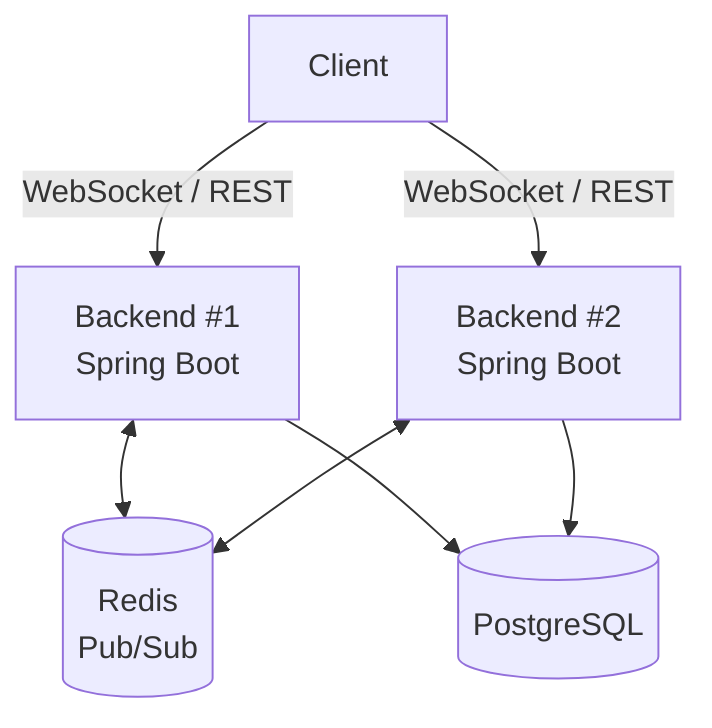

# Real-Time Chat Application

A full-featured real-time chat application built with Spring Boot, featuring WebSocket-based messaging, horizontal scaling via Redis Pub/Sub, and Docker containerization.

## Features

- User registration and authentication (JWT)
- One-on-one and group chats
- Real-time message delivery via WebSocket (STOMP)
- Online/offline presence tracking
- "Typing..." indicator
- Read receipts
- Horizontal scaling via Redis Pub/Sub — multiple backend instances share message delivery
- Containerized with Docker and Docker Compose

## Tech Stack

**Backend:** Java 21, Spring Boot 4, Spring Security, Spring WebSocket (STOMP), Spring Data JPA

**Database:** PostgreSQL 17

**Real-time & scaling:** Redis 8 (Pub/Sub)

**Infrastructure:** Docker, Docker Compose

**Load testing:** k6

## Architecture



The core idea: multiple backend instances run independently but stay in sync via Redis Pub/Sub. A user connected to Backend #1 receives messages sent by a user connected to Backend #2 instantly — without this synchronization, the message would stay confined to a single process.
## Running the Project

### Option 1 — Local (for development)

Requires: Java 21, Maven, PostgreSQL, Redis.

```bash
# create a PostgreSQL database named realtime_app
# configure application.properties (see application.properties.example)

mvn clean package
java -jar target/*.jar
```

### Option 2 — Docker Compose (multiple instances)

Requires: Docker Desktop.

```bash
docker-compose up --build
```

This spins up:
- PostgreSQL on port 5432
- Redis on port 6379
- Backend #1 on port 8081
- Backend #2 on port 8082

Both backend instances share the same database and Redis instance, demonstrating horizontal scaling.

## Load Testing

Load testing was performed using [k6](https://k6.io/) — the script simulates multiple concurrent users logging in.

Test script: [`load-tests/login-test.js`](./load-tests/login-test.js)

### Results

| Virtual Users | Requests/sec | Avg Response Time | 95th Percentile | Errors |
|---|---|---|---|---|
| 10  | 8.4  | 177 ms | 213 ms  | 0%    |
| 50  | 40.8 | 202 ms | 305 ms  | 0%    |
| 100 | 85.0 | 129–152 ms | 165–413 ms | 0%    |
| 200 | 97.6 | 979 ms | 1180 ms | 2.78% |

### Findings

The system handles up to **100 concurrent users** reliably, with zero errors and response times in the 150–200 ms range. At a sharp spike to **200 concurrent users**, performance degrades noticeably — average response time grows nearly 5x, and a 2.78% connection failure rate appears.

The likely cause is connection pool exhaustion (HikariCP defaults to 10 connections per instance). The next step for further scaling would be increasing the connection pool size and re-testing, or adding a third backend instance to distribute the load.

Full test results are available in the [`load-tests/`](./load-tests/) directory.

## Security

- Passwords are hashed with BCrypt before being stored in the database
- Authentication via JWT tokens (for both REST API and WebSocket connections)
- REST endpoints are protected via Spring Security
- WebSocket connections are authenticated through a custom interceptor at the STOMP CONNECT stage

## Roadmap

- [ ] Deploy a live demo on Railway/Render
- [ ] Add a Flutter client
- [ ] Rate limiting to prevent spam
- [ ] Increase connection pool size and re-run load tests